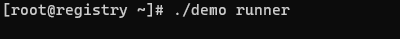

[](https://goreportcard.com/report/github.com/MR5356/go-console-loading)


[](https://www.apache.org/licenses/LICENSE-2.0.html)


## Usage
```go
package main

import (
	"fmt"
	"github.com/MR5356/go-console-loading/loading"
	"os"
	"time"
)

func main() {
	ld := loading.New(os.Args[1])

	ld.Start("Processing...")
	time.Sleep(time.Second * 10)
	fmt.Println()
	ld.Stop()
}

```


## Supported spinners
| name                | spinner              |
|---------------------|----------------------|
| dots9               | ⣇                    |
| pipe                | ├                    |
| toggle10            | ㊀                    |
| dots2               | ⡿                    |
| simpleDots          | ...                  |
| hamburger           | ☲                    |
| growHorizontal      | ▉                    |
| circle              | ⊙                    |
| point               | ∙●∙                  |
| soccerHeader        | 🧑       ⚽️🧑        |
| toggle2             | ▪                    |
| dots4               | ⠠                    |
| dots5               | ⠴                    |
| dots6               | ⠄                    |
| line                |                      ||
| simpleDotsScrolling | ..                   |
| balloon             | O                    |
| triangle            | ◤                    |
| toggle9             | ◎                    |
| toggle13            | *                    |
| shark               | ▐____________/       |▌|
| speaker             | 🔊                   |
| aesthetic           | ▰▰▰▰▰▱▱              |
| dots3               | ⠦                    |
| sand                | ⣶                    |
| growVertical        | ▇                    |
| boxBounce           | ▝                    |
| squish              | ╪                    |
| toggle5             | ▯                    |
| bouncingBar         | [    ]               |
| star2               | x                    |
| flip                | '                    |
| circleHalves        | ◑                    |
| toggle8             | ◌                    |
| toggle11            | ⧆                    |
| arrow               | →                    |
| moon                | 🌕                   |
| dots8               | ⠤                    |
| earth               | 🌎                   |
| dots7               | ⠠                    |
| dots12              | ⢃⠨                   |
| squareCorners       | ◲                    |
| smiley              | 😝                   |
| hearts              | 💜                   |
| pong                | ▐       ⠠▌           |
| orangePulse         | 🟠                   |
| dots11              | ⢀                    |
| star                | ✺                    |
| material            | █████▁▁▁▁▁▁▁▁▁▁▁▁▁▁█ |
| mindblown           | 😧                   |
| dots8Bit            | ⢀                    |
| toggle3             | ■                    |
| toggle4             | ▪                    |
| layer               | =                    |
| orangeBluePulse     | 🔹                   |
| dots                | ⠴                    |
| toggle7             | ⦿                    |
| bluePulse           | 🔵                   |
| binary              | 010111               |
| toggle12            | ☖                    |
| grenade             | ⁎                    |
| betaWave            | βββρβββ              |
| arrow3              | ▹▹▸▹▹                |
| runner              | 🏃                   |
| fistBump            | 　🤜　　🤛　             |
| timeTravel          | 🕕                   |
| arc                 | ◞                    |
| fingerDance         | ✋                    |
| dots10              | ⡁                    |
| line2               | —                    |
| noise               | ▒                    |
| monkey              | 🙉                   |
| boxBounce2          | ▐                    |
| toggle6             | ၀                    |
| clock               | 🕕                   |
| weather             | 🌧                   |
| christmas           | 🎄                   |
| dqpb                | p                    |
| dots13              | ⡟                    |
| balloon2            | °                    |
| bounce              | ⠄                    |
| circleQuarters      | ◶                    |
| toggle              | ⊷                    |
| arrow2              | ⬇️                   |
| bouncingBall        | (    ● )             |
| dwarfFortress       | ☺▓£                  |

## Star History

[](https://star-history.com/#MR5356/go-console-loading&Date)