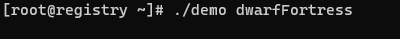
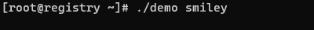

[](https://goreportcard.com/report/github.com/MR5356/go-console-loading)


[](https://www.apache.org/licenses/LICENSE-2.0.html)


## Usage
```go
package main

import (
	"fmt"
	"github.com/MR5356/go-console-loading/loading"
	"os"
	"time"
)

func main() {
	ld := loading.New(os.Args[1])

	ld.Start("Processing...")
	time.Sleep(time.Second * 10)
	fmt.Println()
	ld.Stop()
}

```


## Supported spinners
| name                | spinner                                                |
|---------------------|--------------------------------------------------------|
| aesthetic           |            |
| arc                 |                  |
| arrow               |                |
| arrow2              |               |
| arrow3              |               |
| balloon             |              |
| balloon2            |             |
| betaWave            |             |
| binary              |               |
| bluePulse           |            |
| bounce              |               |
| bouncingBall        |         |
| bouncingBar         |          |
| boxBounce           |            |
| boxBounce2          |           |
| christmas           |            |
| circle              |               |
| circleHalves        |         |
| circleQuarters      |       |
| clock               |                |
| dots                |                 |
| dots10              |               |
| dots11              |               |
| dots12              |               |
| dots13              |               |
| dots2               |                |
| dots3               |                |
| dots4               |                |
| dots5               |                |
| dots6               |                |
| dots7               |                |
| dots8               |                |
| dots8Bit            |             |
| dots9               |                |
| dqpb                |                 |
| dwarfFortress       |        |
| earth               |                |
| fingerDance         |          |
| fistBump            |             |
| flip                |                 |
| grenade             |              |
| growHorizontal      |       |
| growVertical        |         |
| hamburger           |            |
| hearts              |               |
| layer               |                |
| line                |                 |
| line2               |                |
| material            |             |
| mindblown           |            |
| monkey              |               |
| moon                |                 |
| noise               |                |
| orangeBluePulse     |      |
| orangePulse         |          |
| pipe                |                 |
| point               |                |
| pong                |                 |
| runner              |               |
| sand                |                 |
| shark               |                |▌|
| simpleDots          |           |
| simpleDotsScrolling |  |
| smiley              |               |
| soccerHeader        |         |
| speaker             |              |
| squareCorners       |        |
| squish              |               |
| star                |                 |
| star2               |                |
| timeTravel          |           |
| toggle              |               |
| toggle10            |             |
| toggle11            |             |
| toggle12            |             |
| toggle13            |             |
| toggle2             |              |
| toggle3             |              |
| toggle4             |              |
| toggle5             |              |
| toggle6             |              |
| toggle7             |              |
| toggle8             |              |
| toggle9             |              |
| triangle            |             |
| weather             |              |

## Star History

[](https://star-history.com/#MR5356/go-console-loading&Date)